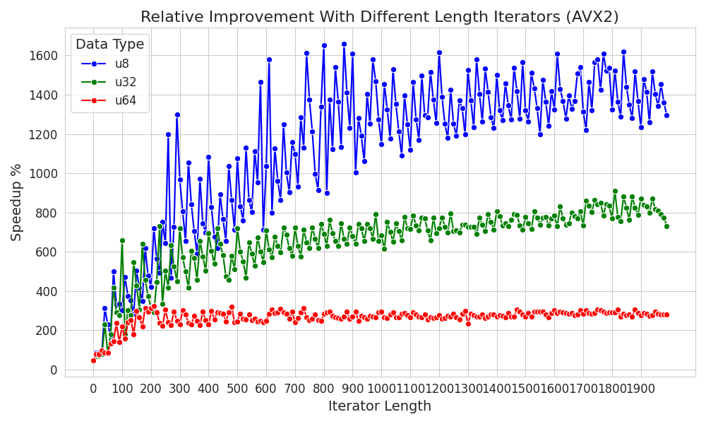

#  SIMD-accelerated iterators

[](https://crates.io/crates/simd-itertools)

Change:
```Rust
arr.iter().contains()
```
To:
```Rust
arr.iter().contains_simd()
```


Currently the following are implemented:

```find```
```filter```
```position```
```contains```
```eq```
```min/max```
```is_sorted```
```all_equal```

And works for slice iterators of types: ```u8,u16,u32,u64,i8,i16,i32,i64,f32,f64,isize,usize```

### 🔥🚀 Performance gain compared to the standard library 🚀🔥

You can expect similar performance across the functions.

Requires nightly for now 😔:
```Rust
rustup toolchain install nightly
rustup default nightly
// revert back to stable: rustup default stable
```
